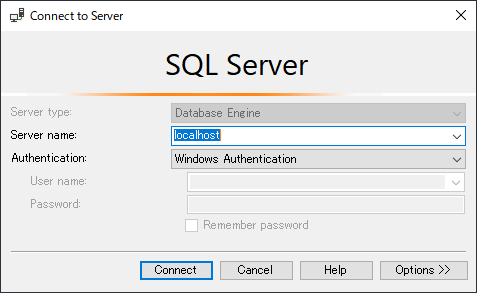
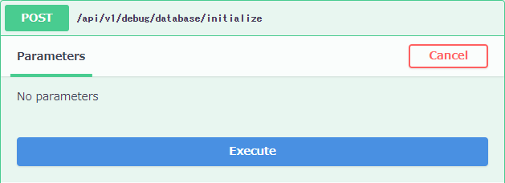
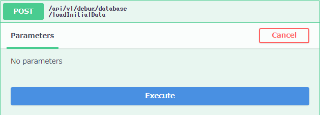
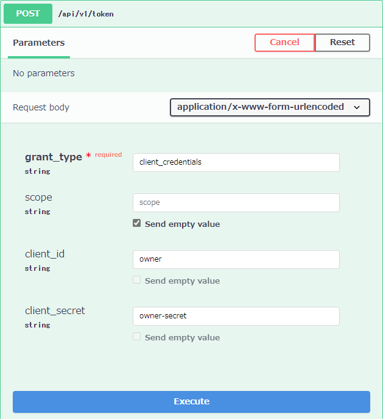
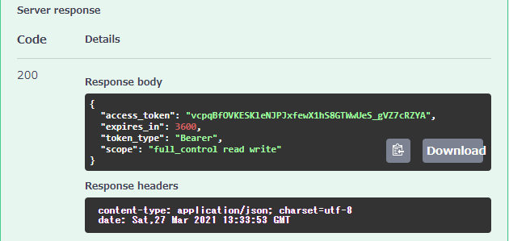
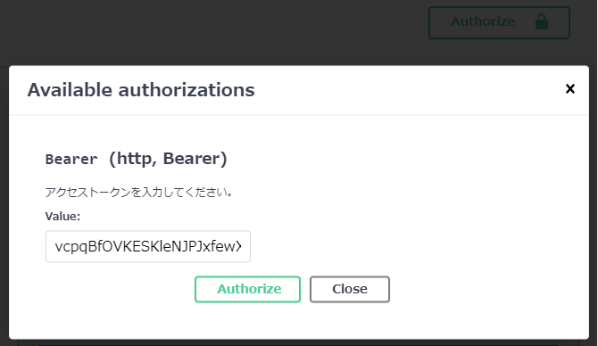

# DailyReport
Daily reporting and Work visualization service. (IN DEVELOPMENT)

## Getting Started

### Prerequisites

- [Visual Studio 2019 Community](https://visualstudio.microsoft.com/vs/community/)
- [SQL Server 2019 Developer](https://www.microsoft.com/en-us/sql-server/sql-server-downloads)
  - Server authentication: SQL Server and Windows authentication mode

### Initialize Database

- Microsoft SQL Server Management Studio
  - Connect to localhost server  
    
  - Execute `\schema\setup.sql`
- Visual Studio
  - Open `WaterTrans.DailyReport.sln`
  - Set as Startup Project: `WaterTrans.DailyReport.Web.Api`
  - Start Debugging
  - Execute `/api/v1/debug/database/initialize`  
    
  - Execute `​/api​/v1​/debug​/database​/loadInitialData`  
    

### Get Access Token

- Visual Studio
  - Start Debugging
  - Execute `/api/v1/token`  
    
    - grant_type: client_credentials
    - client_id: owner
    - owner-secret: owner-secret
  - Copy `access_token`  
    
  - Click `Authorize` and Paste `access_token`  
    
  - You can execute all APIs
